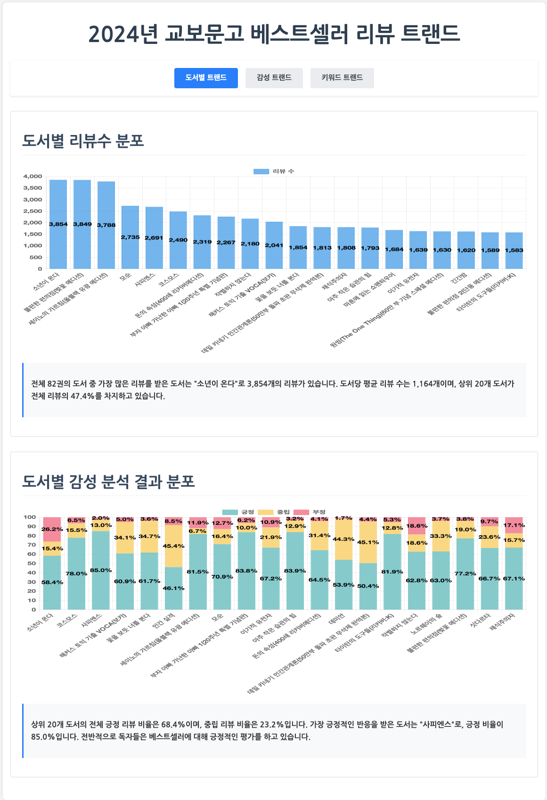
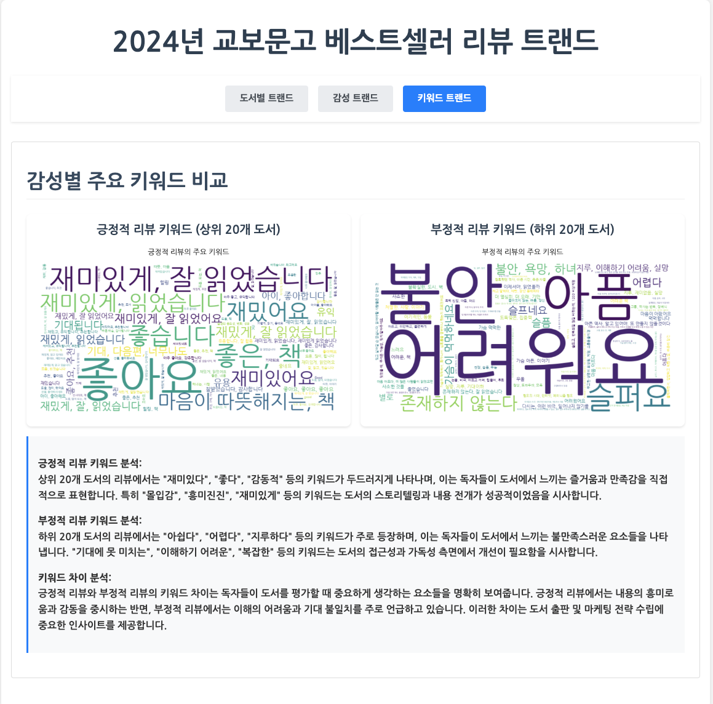

# 2024년 교보문고 베스트셀러 리뷰 트랜드 분석 보고서 구현

## 1. 분석 시각화 결과

결과보고서(HTML)는 웹서버에서 실행하여 확인할 수 있으며, 아래는 주요 시각화 결과의 스크린샷입니다.

<div style="display: flex; justify-content: space-between;">
    
    
    
</div>

## 2. 분석 시각화 결과 html 실행방법

### 1) 터미널에서 명령어로 웹서버 실행
```bash
cd homework/result
python -m http.server 8000
```

### 2) 웹브라우저에서 html 파일 띄우기
```
http://localhost:8000/2024_kyobo_bestseller_review_trend_visualization.html
``` 

### 3) 또는 맥OS인 경우 실행스크립트 실행
```bash
cd homework/bin
./run_server_mac.sh
```

## 3. 소스코드 구조

```
homework/
├── bin/                      # 실행 스크립트 디렉토리
│   └── run_server_mac.sh    # 맥OS용 웹서버 실행 스크립트
│   └── prompt.md            # 프롬프트 모음
├── data/                    # 데이터 저장 디렉토리
├── images/                  # 시각화 결과 이미지 저장
├── result/                  # 결과 파일 저장, 시각화에 사용할 데이터, 이미지, html 파일 저장
├── kyobo_book_list_create.py    # 교보문고 베스트셀러 목록 생성
├── kyobo_book_scroll.py         # 교보문고 웹 스크롤링
├── kyobo_book_reviews_collect.py # 도서 리뷰 수집
├── kyobo_book_analysis.py       # 도서 리뷰 분석
├── create_wordcloud.py          # 워드클라우드 생성
└── requirements.txt            # 프로젝트 의존성 패키지
```

## 4. 분석기법

### 데이터 수집 및 전처리
- Selenium, BeautifulSoup4를 활용한 웹 크롤링
- 텍스트 길이 제한 및 기본 전처리

### 감성 분석
- OpenAI GPT-3.5-turbo 모델 기반 감성 분석
- 긍정/부정/중립 분류 및 감성 점수(-1~1) 산출
- 주요 키워드 추출 및 리뷰 요약

### 시각화
- 워드클라우드를 통한 키워드 시각화
- Chart.js를 활용한 통계 차트 구현
- 도서별 리뷰 및 감성 분석 결과 시각화

## 5. Docker 실행방법

### 사전 준비사항
1. Docker Desktop 설치
   - macOS: [Docker Desktop for Mac](https://www.docker.com/products/docker-desktop) 다운로드 및 설치
   - Docker Desktop이 실행 중이어야 합니다.

### 실행 방법
1. 터미널에서 프로젝트 디렉토리로 이동
   ```bash
   cd homework
   ```

2. 실행 스크립트 권한 부여
   ```bash
   chmod +x run_docker.sh
   ```

3. Docker 컨테이너 실행
   ```bash
   ./run_docker.sh
   ```

### 주요 기능
- Docker Desktop 자동 실행 및 상태 확인
- 포트(8000) 충돌 감지 및 해결
- 웹 서버 자동 실행 및 브라우저 오픈
- 컨테이너 로그 실시간 확인

### 문제 해결
1. "Cannot connect to the Docker daemon" 오류 발생 시
   - Docker Desktop이 실행 중인지 확인
   - Docker Desktop을 수동으로 실행 후 재시도

2. "포트 8000이 이미 사용 중" 오류 발생 시
   - 스크립트의 안내에 따라 프로세스 종료 여부 선택
   - 'y'를 입력하여 자동 종료 진행

3. 웹 페이지 로딩 실패 시
   - 브라우저에서 직접 `http://localhost:8000/2024_kyobo_bestseller_review_trend_visualization.html` 접속
   - Docker 컨테이너 로그 확인